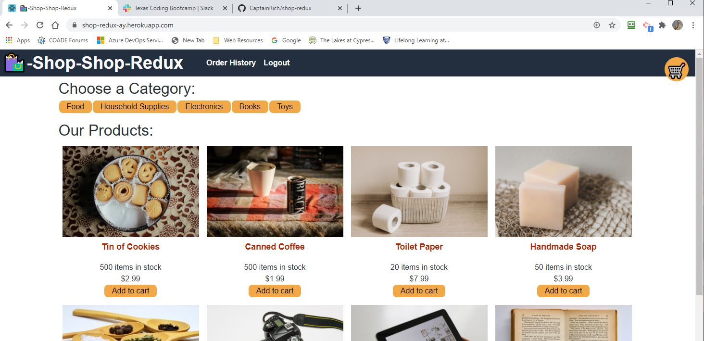
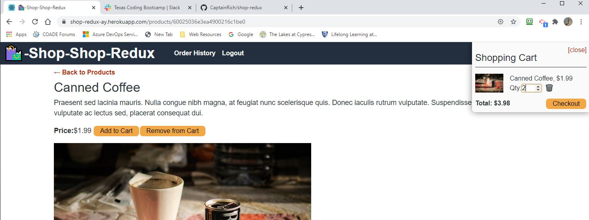
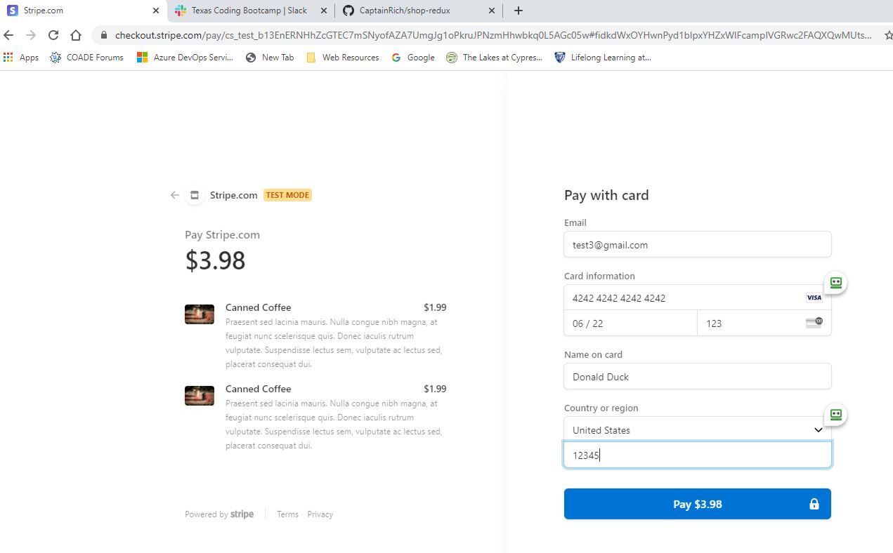
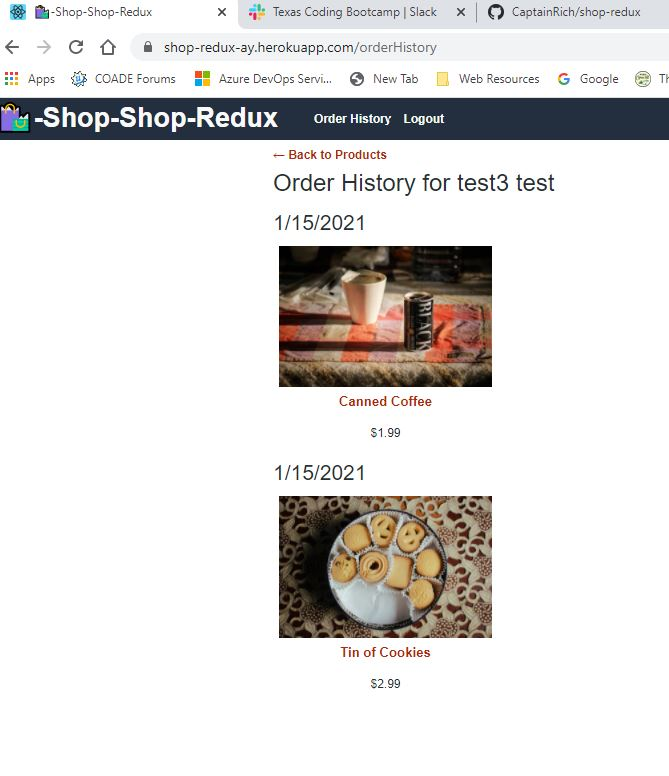

# Shop-Shop Redux (A conversion from React Context to Redux)
(Richard Ay - January 2021)

## Table of Contents
* [Project Objective](#project-objective)
* [Acceptance Criteria](#acceptance-criteria)
* [Installation](#installation)
* [Technologies Used](#technologies-used)
* [Deployment Link](#deployment-link)
* [Application Screen Shot](#application-screen-shot)

## Project Objective
As a senior engineer working on an e-commerce platform I want my platform to use Redux to manage global state instead of the Context API, so that my website's state management is taken out of the React ecosystem.

For refactoring steps see: 'refactoring_steps.md'.

## Acceptance Criteria
Given an e-commerce platform that uses Redux to manage global state:

* When I review the app’s store then I find that the app uses a Redux store instead of the Context API.

* When I review the way the React front end accesses the store then I find that the app uses a Redux provider.

* When I review the way the app determines changes to its global state then I find that the app passes reducers to a Redux store instead of using the Context API.

* When I review the way the app extracts state data from the store then I find that the app uses Redux instead of the Context API.

* When I review the way the app dispatches actions then I find that the app uses Redux instead of the Context API.

## Installation
For local usage, run 'npm install' to install all of the dependencies.  After installing the dependencies, run 'npm start'.  To run on Heroku, see the deployment section below.

## Technologies Used

* GraphQL
* Apollo Server
* JWT (JSON Web Token)
* NodeJS, Express.JS
* MongoDB
* Redux
* React

## Deployment Link
The deployment link on Heroku is: https://shop-redux-ay.herokuapp.com   
[Heroku](https://shop-redux-ay.herokuapp.com/) 

## Application Screen Shot

 Image of the main store.

 Image of the shopping cart.

 Image of the (stripe) payment page.

 Image of the (order) success page.

 Image of the order history page.

